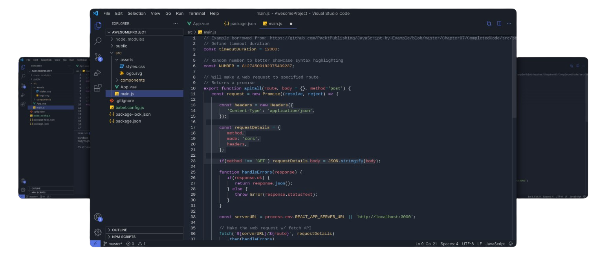

Immerse yourself in the depths of productivity with IceBerg, a dark bluish theme for Visual Studio Code designed to enhance your coding experience with its serene and elegant color palette. Inspired by the cool depths of the ocean, IceBerg provides a calming and focused environment that promotes concentration and creativity.

